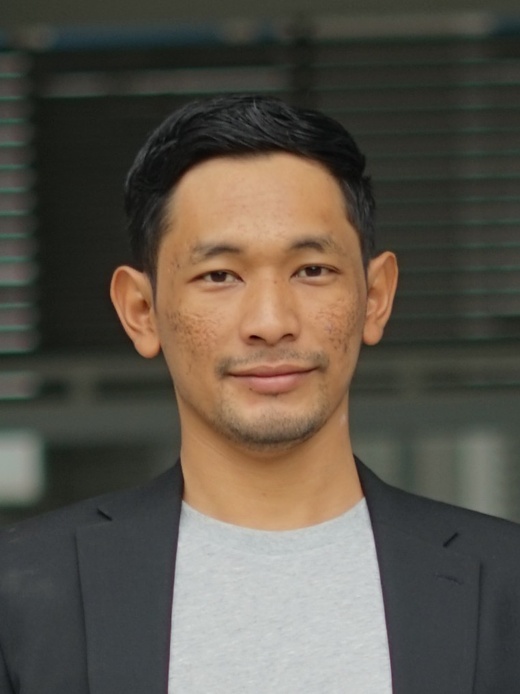

---
hide:
  - toc
  - navigation
---
<!--
CHECKLIST FOR THIS PAGE:
- [ ] Replace [YOUR NAME] with your full name (3 places)
- [ ] Replace [YOUR JOB TITLE] with your current or target role
- [ ] Replace [YOUR TAGLINE] with a short phrase describing your focus
- [ ] Rewrite the About Me paragraph with your own words
- [ ] Replace assets/images/profile.png with your actual photo (keep the filename or update it below)
- [ ] Replace assets/images/about.png with your own image (a field photo, map, or workspace shot)
- [ ] Edit the skill cards to match your actual skills (add, remove, or rename cards as needed)
- [ ] Update GitHub and LinkedIn links in the Connect section
- [ ] Add your CV PDF to docs/assets/ and update the filename in the Download CV button
-->

  
  <h1>Abyan Abdan</h1>
  
<strong>Geologist & Geospatial Developer</strong>

  
<em>[ Geology | Natural Resources | GIS | Remote Sensing | Geospatial Data Science ]</em>

---

## About Me

I am a geologist with demonstrated experience in GIS and Remote Sensing applied to natural resource exploration and energy industry. I have worked in multidisciplinary roles and international environments, using geospatial data to support the evidence-based decision-making and the sustainable management of natural resources. I seek to strengthen my technical skills and contribute to the innovation of geospatial solutions with global impact.

  

---

[View My Projects :material-arrow-right:](projects/index.md){ .md-button .md-button--primary }
[Download CV :material-download:](assets/pdf/abyanabdan-CV.pdf){ .md-button }

---

## Skills

-   :material-earth:{ .lg .middle } **Geological Engineering**

    ---

    - Natural Resources — Energy, Metals, Industrial Mineral
    - Field Geology — Mapping, Rock Sampling, Regional Exploration
    - Geological Database, Mining Operation, Quality Control, Cargo Shipment
    - Laboratory Analysis — Coal Proximate Analysis, X-Ray Diffraction, Petrography
    - Data Analysis & Visualisation — Graphs and Maps
    - Geoenvironmental — Acid Mine Drainage, Waste Rock Management

-   :material-layers:{ .lg .middle } **GIS & Remote Sensing**

    ---

    - Softwares — QGIS, ArcGIS Desktop, ArcGIS Pro, Global Mapper, ENVI
    - Imageries — LANDSAT, ASTER, UAV

-   :material-code-braces:{ .lg .middle } **Programming**

    ---

    - Python — Pandas, GeoPandas, NumPy, Matplotlib
    - R — sf, terra, ggplot2
    - JavaScript — Leaflet, MapLibre GL
    - SQL, PostgreSQL + PostGIS

-   :material-star-four-points:{ .lg .middle } **Machine Learning & GeoAI**

    ---

    - Supervised classification — Random Forest, XGBoost
    - Deep learning for image segmentation — U-Net, SAM
    - scikit-learn, PyTorch, TensorFlow
    - Object detection in satellite imagery

-   :material-earth:{ .lg .middle } **Web Mapping & Data**

    ---

    - Leaflet.js, Folium, MapLibre GL JS
    - Cloud storage — AWS S3, Google Cloud Storage
    - Data formats — GeoTIFF, GeoParquet, NetCDF
    - Streamlit for data-driven web apps

-   :material-airplane:{ .lg .middle } **Drone / UAV Data Processing**

    - Mission planning and flight operations
    - Photogrammetry: Agisoft Metashape, OpenDroneMap
    - Point cloud processing: CloudCompare, PDAL

---

## Connect

[GitHub](https://github.com/abyanab){ .md-button }
[LinkedIn](https://linkedin.com/in/abyan-abdan){ .md-button }